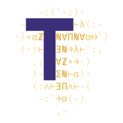
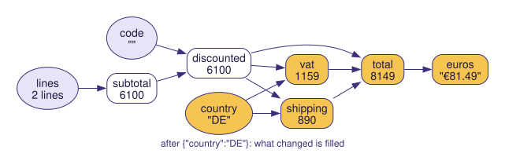

<p align="center">
  
</p>

<h1 align="center">lun</h1>

<p align="center">
  <em>Typed, live reactive graphs from a Lean project: register a graph, update an input, get back what changed.</em>
</p>

<p align="center">
  <a href="https://github.com/typednotes/lun/actions/workflows/lean_action_ci.yml"></a>
  <a href="https://github.com/typednotes/lun/actions/workflows/docker-publish.yml"></a>
  <a href="https://github.com/typednotes/lun/pkgs/container/lun"></a>
  <a href="https://github.com/typednotes/lun/tags"></a>
  <a href="https://lean-lang.org/"></a>
  <a href="https://github.com/typednotes/linen"></a>
  <a href="LICENSE"></a>
</p>

---

`lun` turns a Lean project — a git repository pinned at a commit — into typed
services. You name some of its **functions**, each under a declared signature,
and some **graphs**: programs in [`linen`](https://github.com/typednotes/linen)'s
reactive `Control.Reactive` monad that wire those functions together. lun
fetches the project, checks every signature and every graph, compiles it, and
serves it over HTTP: each function on its own, each graph at once, or as a
live **session** whose inputs you update one at a time — only what depends on
them runs again, and only what changed comes back.

<p align="center">
  
</p>

<p align="center"><sub>The example's <code>invoice</code> graph after <code>{"country": "DE"}</code>, drawn with Graphviz by <code>lake exe lun-example --dot</code>.</sub></p>

The projects it runs are the ones [`lode`](https://github.com/typednotes/lode),
the agent, writes; private repositories are fetched through
[`liaison`](https://github.com/typednotes/liaison), so lun never holds a
credential.

## Table of contents

- [Features](#features)
- [Example](#example)
- [Functions and graphs](#functions-and-graphs)
- [What is checked](#what-is-checked)
- [HTTP API](#http-api)
- [Configuration](#configuration)
- [Docker](#docker)
- [Development](#development)
- [Project status](#project-status)
- [License](#license)

## Features

- **Typed functions** — a function of the project is served only if it *is*
  a function of its declared signature `α₁ → … → αₙ → Eff effs β`, with JSON
  arguments and result, whose effects are linen's vetted `Trace`, `Error`,
  `HTTP` and `FileSystem`, run by linen's own handlers.
- **Reactive graphs** — written in linen's `Reactive` monad, where each
  function applies to observables; wiring a function to a value of the wrong
  type does not compile, and a graph may only apply the declared functions.
- **Live sessions** — a graph registered once keeps its inputs; an update
  feeds only the inputs it names, recomputes only what depends on them (an
  input set to its current value runs nothing), and answers with the nodes
  whose outcome changed. A failing function recovers when its inputs change.
  Sessions survive restarts.
- **Errors stay local** — a failure is its node's outcome; its dependents are
  skipped, and the rest of the graph carries on.
- **Diagnostics where they belong** — every build message is attributed to
  the function, the graph (with its line in the program) or the project.
- **No credentials** — private GitHub and GitLab repositories are read
  through liaison, with a warrant the typednotes app mints.

## Example

[`Examples/pricing`](Examples/pricing) is a Lean project with an invoice's
functions (`subtotal`, `discounted`, `shipping`, `vat`, `total`, `euros`);
[`Examples/Client.lean`](Examples/Client.lean) asks lun to build it, registers
this graph as a session, and updates its inputs:

```lean
do
  let lines ← input "lines" (List Pricing.Line)
  let code ← input "code" String
  let country ← input "country" String
  let sub ← subtotal lines
  let net ← discounted sub code
  let ship ← shipping net country
  let tax ← vat net country
  let due ← total net ship tax
  euros due
```

```sh
Examples/run.sh ../linen        # a local lun; a linen checkout to reuse its build (optional)
```

```
▸ start {"code":"","country":"FR","lines":[…]}
    subtotal    6100
    discounted  6100
    shipping    490
    vat         1220
    total       7810
    euros       "€78.10"
    ran: subtotal, discounted, shipping, vat, total

▸ ship to Germany instead: {"country":"DE"}
    country     "DE"
    shipping    890
    vat         1159
    total       8149
    euros       "€81.49"
    ran: shipping, vat, total

▸ a code that does not exist: {"code":"SUMMER"}
    code        "SUMMER"
    discounted  error: unknown discount code 'SUMMER'
    shipping    skipped (discounted has no value)
    vat         skipped (discounted has no value)
    total       skipped (discounted has no value)
    euros       skipped (total has no value)
    ran: discounted

▸ a real one: {"code":"VIP"}
    code        "VIP"
    discounted  4880
    …
    ran: discounted, shipping, vat, total

▸ the same country again: nothing to do: {"country":"DE"}
    (nothing changed)
    ran: nothing
```

(`ran` is read off the functions' traces.) Against a deployed lun, point the
client at the pushed repository:
`lake exe lun-example --lun https://… --token … --repo https://github.com/typednotes/lun --commit <sha> --path Examples/pricing`.

The same session over plain HTTP:

```sh
curl -X POST $LUN/v0/builds/$BUILD/graphs/invoice/sessions -d '{"inputs": {"lines": […], "code": "", "country": "FR"}}'
# 201 {"session": "9f…", "nodes": [...]}
curl -X POST $LUN/v0/sessions/9f… -d '{"inputs": {"country": "DE"}}'
# 200 {"changed": [{"id": 2, "input": "country", "output": "DE"}, {"id": 5, "function": "shipping", "args": [4, 2], "output": 890}, …], "nodes": [...]}
```

## Functions and graphs

- **A function** is a function of the project under a name and a declared
  signature: `α₁ → … → αₙ → Eff effs β`. Each argument is a JSON value (a
  `Lean.FromJson` type), or `Unit` for none; the result is linen's effect
  monad `Eff` over a row of effects, producing a JSON value (`Lean.ToJson`).
  The row is the function's effect whitelist.
- **A graph** is a program in linen's `Reactive` monad (`Control.Reactive`,
  linen ≥ 1.3.0): named `input`s, and functions applied to observables (each
  application is a `combineLatest` over the function). A function can be
  applied any number of times; a graph is acyclic by construction.

In signatures and graphs, `Control.Monad.Effect` is open (so `Eff`,
`Trace.Trace`, `Error.Error`, `HTTP.HTTP`, `FileSystem.FileSystem`), and in
graphs `Control.Reactive`, `input` and the functions by name.

## What is checked

A build fails, with diagnostics attributed to the function, graph (with its
line in the program) or project concerned, unless:

- the repository's `commit` is on `branch`;
- the project has a `lakefile`, a `lean-toolchain` and a committed
  `lake-manifest.json` that depends on **linen only**;
- each declared function **is** a Lean function of its declared signature (up
  to definitional unfolding; implicit arguments, e.g. a polymorphic effect
  row, are instantiated by it; no coercion), non-dependent, ending in `Eff`,
  and:
  - every effect in its row is one of linen's `Trace`, `Error ε`, `HTTP cap`,
    `FileSystem cap`, handled by linen's own `Handler _ IO` instance (not one
    the project defines);
  - it is not `unsafe` and does not depend on `sorry`;
- each graph builds its nodes only through `input` and the declared functions
  (its definition is walked through every non-library constant it reaches;
  the graph builder's primitives are refused), does not depend on `sorry`,
  and consists only of inputs, each named once, and applications of declared
  functions with their arity — linen's other operators are refused. Every
  function in the graph is replaced by the declared function it names before
  it runs.

Signatures and graph programs are Lean text, parsed as exactly one term each
(they are embedded as raw string literals, never spliced as code).

## HTTP API

| Route | |
|---|---|
| `GET /_health` | `200 ok` |
| `POST /v0/builds` | submit a build; `202` + status while it runs, `200` if that build is already ready |
| `GET /v0/builds/{id}` | status: `state` (`queued`, `fetching`, `building`, `ready`, `failed`), `error`, `diagnostics`, and once ready `functions` and `graphs` (each graph's inputs, nodes, sources and sinks) |
| `GET /v0/builds/{id}/log` | the build log |
| `POST /v0/builds/{id}/functions/{name}` | call a function |
| `POST /v0/builds/{id}/graphs/{name}` | run a graph once, with every input |
| `POST /v0/builds/{id}/graphs/{name}/sessions` | register a graph as a session: `201` |
| `GET /v0/sessions/{session}` | a session's nodes |
| `POST /v0/sessions/{session}` | update some of its inputs |
| `DELETE /v0/sessions/{session}` | end it |

With `LUN_TOKEN` set, every route but `/_health` needs
`Authorization: Bearer {token}`. Errors are `{"error": message}`.

### Build request

```jsonc
{
  "source": {
    "url": "https://github.com/owner/repo",     // as for `git clone`; github.com, gitlab.com or any https host
    "branch": "main",
    "commit": "0123…cdef",                       // full hash, on `branch`
    "path": "lean",                              // optional: the directory with the lakefile
    "credentials": {                             // optional: for a private github.com / gitlab.com repository
      "warrant": { … },                          // the warrant the typednotes app mints for the connection
      "account": "{user_id}/{connection_id}"
    }
  },
  "open": ["MyProject"],                         // optional: namespaces opened for signatures and graphs
  "functions": [
    { "name": "math.double", "module": "MyProject.Math",
      "function": "MyProject.Math.double", "signature": "Nat → Eff [] Nat" }
  ],
  "graphs": [
    { "name": "main", "program": "do\n  let x ← input \"x\" Nat\n  math.double x" }
  ]
}
```

The same request (same org) is the same build: submitting it again returns it.

### Functions

| Request | Response |
|---|---|
| `{"input": x}` — `x` is the value (one argument), an array of them (several), or omitted (no argument) | `{"output": y}` or `{"error": "…"}` |
| `{"inputs": [x₁, x₂, …]}` — one call each | `{"outputs": [{"output": y₁}, {"error": "…"}, …]}` |

A function's `Trace` output comes back as `"log"` (on every route).

### Graphs, once

`{"inputs": {"x": 5}}` → one entry per node, in order:

```json
{"nodes": [
  {"id": 0, "input": "x", "output": 5},
  {"id": 1, "function": "seed", "args": [], "output": 10},
  {"id": 2, "function": "math.double", "args": [0], "output": 10},
  {"id": 3, "function": "add", "args": [2, 1], "error": "…"},
  {"id": 4, "function": "render", "args": [3], "skipped": 3}
]}
```

Every input is fed once (a missing one is fed an error). A failure stays with
its node: its dependents are `skipped`, naming their first argument without a
value, and everything else still runs.

### Sessions

- `POST /v0/builds/{id}/graphs/{name}/sessions` with `{"inputs": {…}}`
  (optional; inputs not given have no outcome yet, nor has what depends on
  them) → `201 {"session": id, "nodes": [...]}`.
- `POST /v0/sessions/{session}` with `{"inputs": {"country": "DE"}}` →
  `{"changed": [...], "nodes": [...], "updates": n}`: `changed` lists, in
  order, the nodes whose outcome (value, error or being skipped) differs from
  before. An unknown input is a `400` and leaves the session untouched.
- `GET` a session for its nodes, `DELETE` it to end it.

A session's state is linen's: its reactive graph's `Session` (the clock and
every node's operator state), which lun stores between calls
(`{workdir}/sessions/`) and hands back to the driver with each update.
Several inputs in one update are fed in order at one instant: a function
reading two of them may run for the intermediate state too; only the final
outcomes are reported. The session id is its capability: 32 random bytes.

### Private repositories

lun never sees a credential. For a private repository it sends each host API
call to liaison (`POST /v0/egress`) with the request's warrant, exactly as the
typednotes app does; liaison checks the warrant, attaches the credential, and
relays the answer. lun speaks liaison's wire format with liaison's own module
(`Liaison.Wire`), so a warrant liaison would refuse as malformed is refused
when the build is requested. It checks the branch with the host's compare /
merge-base API and downloads the commit's archive. Public repositories are
cloned with `git`.

## Configuration

```sh
lake build
LUN_WORKDIR=/tmp/lun LUN_TOKEN=… LUN_LIAISON_URL=http://localhost:8080 lake exe lun
```

| Variable | Default | |
|---|---|---|
| `LUN_PORT` | `8080` | |
| `LUN_WORKDIR` | `/var/lib/lun` | builds (`builds/{id}/`: status, log, checkout, driver) and sessions (`sessions/`) |
| `LUN_TOKEN` | — | bearer token for the API; unset means unauthenticated (logged loudly) |
| `LUN_LIAISON_URL` | — | liaison, for private repositories |
| `LUN_BUILD_TIMEOUT` / `LUN_FETCH_TIMEOUT` / `LUN_CALL_TIMEOUT` | `3600` / `600` / `60` | seconds |
| `LUN_PACKAGE_CACHE` | — | pre-built linen checkouts, `{cache}/linen/{rev}` |
| `LUN_ID_SALT` | random | salt for build ids; set it so ids (and ready builds) survive restarts |
| `LUN_ALLOW_LOCAL` | — | `1`: accept `file://` repositories and path dependencies. Tests and examples only |

Needs `git`, `tar`, `elan`/`lake` and linen's native build dependencies on the
`PATH` (see the `Dockerfile`).

## Docker

Images are published to `ghcr.io/typednotes/lun` — `edge` from `main`, and
`latest`, `X.Y.Z` and `X.Y` from release tags.

```sh
docker run --rm -p 8080:8080 -v lun:/var/lib/lun \
  -e LUN_TOKEN=… -e LUN_ID_SALT=… -e LUN_LIAISON_URL=http://liaison:8080 \
  ghcr.io/typednotes/lun:latest
```

The image carries the Lean toolchain and a package cache of linen
(`LINEN_REF`, default `v1.6.1`) pre-built for what functions need, so a build
compiles only the project and its functions. To build it locally:
`docker build -t lun .` (or `podman build`).

## Development

```sh
lake build LunTests          # unit tests (#guard)
test/e2e.sh ../linen         # end to end, against a linen checkout (>= 1.3.0; CI uses v1.6.1)
Examples/run.sh ../linen     # the example
```

`test/e2e.sh` turns `test/fixture` into a git repository, runs lun in local
mode, and exercises the API: builds, functions, graphs, sessions, and each
refusal.

## Project status

`lun` is at **v0**. Each call runs the compiled driver as a process (no
long-lived workers); a graph request is one instant of its reactive graph, not
a stream, and graphs may only apply the declared functions (not linen's `map`,
`filter`, timed operators…); types bound a function's declared authority but
are not a sandbox — the container is. See [`AGENTS.md`](AGENTS.md) for the
layout and the full list of named gaps.

## License

Licensed under the [Apache License, Version 2.0](LICENSE).
