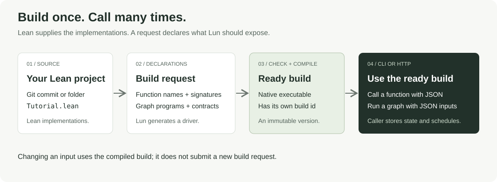
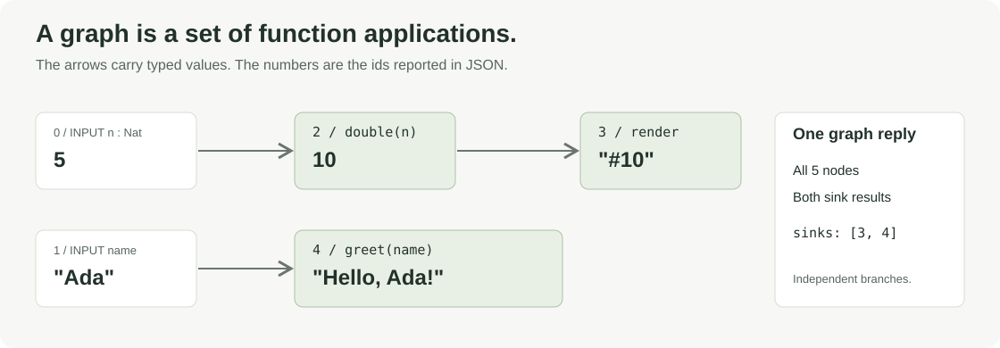
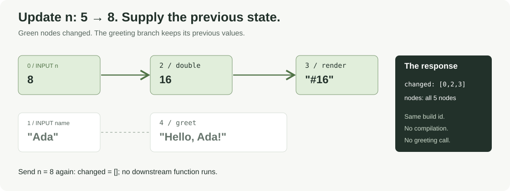
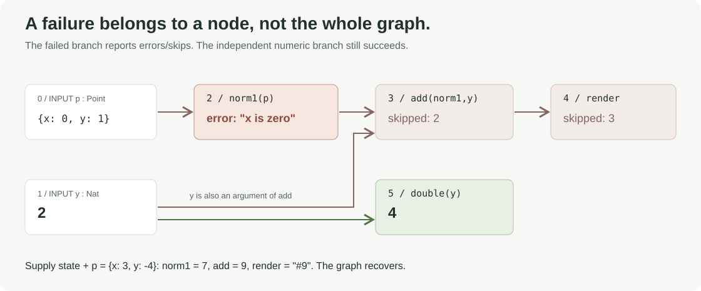
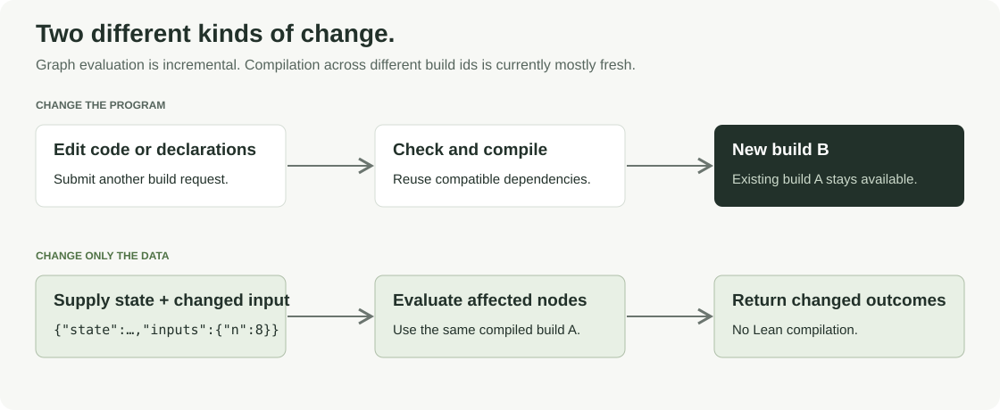

# Lun user guide

**Write typed Lean functions, declare how to expose them, build once, and call
them with JSON.** Connect those functions into a graph when one result feeds
another. Execute a graph in resumable steps: each call returns changed values,
updated JSON state, and the timestamp for the next call. Your application owns
the state, database, and scheduler; Lun owns compilation and execution.

This guide explains that workflow from the user's side. It includes a
[complete runnable cookbook](../Examples/guide/README.md), rather than requiring
you to assemble all the snippets yourself. The examples target this checkout's
CLI/HTTP API and coordinated Linen 1.11.0 runtime.

## Contents

1. [The mental model](#1-the-mental-model)
2. [Try it before writing any code](#2-try-it-before-writing-any-code)
3. [What a Lean project contains](#3-what-a-lean-project-contains)
4. [What a build request declares](#4-what-a-build-request-declares)
5. [Build and call through the CLI](#5-build-and-call-through-the-cli)
6. [Use the same operations over HTTP](#6-use-the-same-operations-over-http)
7. [Function recipes](#7-function-recipes)
8. [Graph recipes](#8-graph-recipes)
9. [Stateless execution, persistence, and scheduling](#9-stateless-execution-persistence-and-scheduling)
10. [Errors and recovery](#10-errors-and-recovery)
11. [Types and wiring contracts](#11-types-and-wiring-contracts)
12. [Effects and permissions](#12-effects-and-permissions)
13. [Choose a source: folder or Git](#13-choose-a-source-folder-or-git)
14. [Build reuse, workers, and incremental behavior](#14-build-reuse-workers-and-incremental-behavior)
15. [Configuration and troubleshooting](#15-configuration-and-troubleshooting)
16. [API reference and next steps](#16-api-reference-and-next-steps)

## 1. The mental model



There are five useful words:

- **Function:** a Lean implementation exposed under a public name and a declared
  signature. For example, `Tutorial.double` can be exposed as `double`.
- **Graph:** a program that creates named inputs and applies the declared
  functions to them and to each other's results.
- **Build:** an immutable compiled version of a particular source and set of
  declarations. Its build id selects that version when you call it.
- **Node:** one input or one function application in a graph. A function can be
  used at several different nodes.
- **State:** the JSON execution snapshot returned by a graph call: current node
  outcomes, producer continuations, and any queued emissions. The caller stores it.

The source code and the request have different jobs. Your `.lean` files contain
the function implementations. The **build request** selects those implementations,
declares their types, and supplies graph programs. **Execution requests** supply
JSON arguments, inputs, and optional previous state to a ready build. An update supplies new data;
it does not edit or recompile the Lean program.

Both transports use the same operations:

```text
Lean project + build declarations → build id

build id + function name + JSON arguments → function outcome
build id + graph name + inputs + state    → changed outcomes + new state + nextCallAt
```

Lun is the runner. [Lode](https://github.com/typednotes/lode) is an agent that can
write projects for it. You can write and test a project yourself without Lode.

## 2. Try it before writing any code

Run these commands from the Lun repository root. You need Lean/Lake, Git,
Python 3, `pkg-config`/libpq, Linen's native build dependencies, and
[uv](https://docs.astral.sh/uv/getting-started/installation/). See the
[repository configuration](../README.md#configuration) for the native prerequisites.
uv manages the example's Python environment and installs Rich automatically.

### A small interactive example

```sh
uv run Examples/interactive/run.py
```

Enter commands such as:

```text
double 21
n 8
name Ada
show
quit
```

`double 21` calls one function. `n 8` and `name Ada` update different branches
of a graph whose state the client retains. `show` displays its latest reply.
The client prints formatted JSON replies and removes its temporary project on exit.

Use an automatically started local HTTP server instead:

```sh
uv run Examples/interactive/run.py --transport http
```

### A larger, verified cookbook

```sh
uv run Examples/guide/run.py
uv run Examples/guide/run.py --transport http
```

This client builds the project described below, prints the requests and replies,
and checks the results. It covers single and batched calls, structured arguments,
graphs, partial inputs, unchanged inputs, error recovery, delayed producers, scoped temporary
files, permission denials, and compile-time contract failures. The HTTP and
connector denial examples do not contact an external provider.

The cookbook client waits for HTTP builds and presents terminal build failures
with the same `422` status as the synchronous CLI. The raw REST submission/polling
statuses are explained in [section 6](#6-use-the-same-operations-over-http).

For just the verification summary:

```sh
uv run Examples/guide/run.py --quiet
uv run Examples/guide/run.py --transport http --quiet
```

The first native compilation can take a few minutes. Both clients reuse Lun's
coordinated dependency checkouts; `--linen /absolute/path/to/linen` selects a
different coordinated Linen checkout.

## 3. What a Lean project contains

The cookbook's project is under [`Examples/guide/project`](../Examples/guide/project).
It is a normal Lake project:

```text
project/
├── Tutorial.lean          # your function implementations
├── lakefile.toml          # package, library, Linen dependency
├── lean-toolchain        # Lean version
└── lake-manifest.json     # resolved dependency lock
```

A project served by Lun may depend on **Linen only**, in addition to Lean's
standard library. The generated driver adds the runtime SDK it needs. You do
not add a web server or write a `main` function inside your project.

A standalone lakefile can pin Linen from Git:

```toml
name = "lun_guide"
defaultTargets = ["Tutorial"]

[[require]]
name = "linen"
git = "https://github.com/typednotes/linen"
rev = "v1.11.0"

[[lean_lib]]
name = "Tutorial"
```

For local development, the `require` can instead point to a coordinated local
checkout:

```toml
[[require]]
name = "linen"
path = "/absolute/path/to/linen"
```

After changing dependencies, run `lake update` from the project directory to
produce its `lake-manifest.json`. Lun requires that lock file. For Git sources,
the lock must be committed; for a folder, it is captured in the snapshot.

The simplest served functions look like this:

```lean
import Linen.Control.Monad.Effect

namespace Tutorial
open Control.Monad.Effect

def double (n : Nat) : Eff [] Nat := pure (2 * n)
def greet (name : String) : Eff [] String := pure s!"Hello, {name}!"
def seed : Unit → Eff [] Nat := fun _ => pure 10

end Tutorial
```

Read `Nat → Eff [] Nat` as “take a natural number and produce a natural number,
using no effects.” `Eff []` is still a computation type: even a pure served
function ends in `Eff`. `Unit` expresses a function with no JSON arguments.

## 4. What a build request declares

A build request selects the source and lists what to expose. Here is a reduced
example using three of the cookbook's functions:

```json
{
  "source": {"directory": "/absolute/path/to/project"},
  "functions": [
    {
      "name": "double",
      "module": "Tutorial",
      "function": "Tutorial.double",
      "signature": "Nat → Eff [] Nat",
      "outputType": "Nat"
    },
    {
      "name": "render",
      "module": "Tutorial",
      "function": "Tutorial.render",
      "signature": "Nat → Eff [] String",
      "outputType": "String"
    },
    {
      "name": "greet",
      "module": "Tutorial",
      "function": "Tutorial.greet",
      "signature": "String → Eff [] String",
      "outputType": "String"
    }
  ],
  "graphs": [
    {
      "name": "parallel",
      "program": "do\n  let n ← input \"n\" Nat\n  let name ← input \"name\" String\n  let doubled ← double n\n  let _ ← render doubled\n  greet name",
      "inputTypes": {"n": "Nat", "name": "String"},
      "dependencies": {
        "double": ["n"],
        "render": ["double"],
        "greet": ["name"]
      }
    }
  ]
}
```

The three names in a function declaration are deliberately separate:

- `module` tells Lean which module to import: `Tutorial` corresponds to
  `Tutorial.lean`; `Tutorial.Math` would correspond to `Tutorial/Math.lean`.
- `function` is the full Lean declaration name, including its namespace.
- `name` is Lun's public function name, used in routes and graph programs.
  It can also be dotted, such as `math.double`.

`signature` is the type Lun checks against the implementation. `outputType`
adds an independent caller-owned result-type constraint. `inputTypes` and
`dependencies` add source and wiring constraints, explained in
[section 11](#11-types-and-wiring-contracts).

`program` is one Lean term encoded as a JSON string. Its `\n` sequences become
line breaks when Lean parses it. Lun opens the effect and graph namespaces needed
by these examples. An optional top-level `open` array can open your namespaces:

```json
{"open": ["Tutorial"]}
```

The cookbook's [`build.json`](../Examples/guide/build.json) contains the complete
declarations for every recipe in this guide. The manual commands below use that
file, so all the named functions and graphs are available.

## 5. Build and call through the CLI

### Prepare a local project and work directory

The following shell recipes assume Bash-compatible syntax, `jq`, and that your
current directory is the Lun repository root:

```sh
WORK="$(mktemp -d /tmp/lun-guide.XXXXXX)"
unset LUN_ID_SALT
export PROJECT="$WORK/project"
export LUN_BIN="$PWD/.lake/build/bin/lun"
export LUN_WORKDIR="$WORK/lun"
export LUN_LIAISON_SDK_PATH="$PWD/.lake/packages/liaison"
export LUN_TEMP_ROOT="$WORK/temporary"

uv run Examples/guide/run.py --prepare "$PROJECT"
jq --arg directory "$PROJECT" '.source.directory = $directory' \
  Examples/guide/build.json > "$WORK/build.json"
```

`--prepare` copies the project and gives it a local Linen dependency, reusing
the compiled library. It does not run a server. Your resulting folder remains
available for edits and manual requests.

### Submit the build

```sh
jq -c '{method:"POST", path:"/v0/builds", body:.}' "$WORK/build.json" \
  | "$LUN_BIN" cli > "$WORK/build-reply.json"

BUILD="$(jq -er '.body | select(.state == "ready") | .id' "$WORK/build-reply.json")"
export BUILD
jq '{status, state:.body.state, id:.body.id}' "$WORK/build-reply.json"
```

CLI builds wait by default. A successful reply has `status:200` and
`body.state:"ready"`; a compilation failure has `status:422` and diagnostics
in `body`. Build ids are full 64-character lowercase hexadecimal strings.

Lun's raw CLI uses **one compact JSON object per input line and one JSON reply
per output line**. The wrapper has `method`, `path`, and an optional object
`body`. For example:

```json
{"method":"GET","path":"/_health"}
```

```json
{"status":200,"body":"ok"}
```

The Rich example clients format the replies for people. The raw CLI protocol
itself remains JSON-lines. Diagnostics go to stderr.

### A shell helper for the rest of the guide

```sh
rpc() {
  local method="$1" path="$2" body="${3-}"
  if [ -z "$body" ]; then body='{}'; fi
  jq -cn --arg method "$method" --arg path "$path" --argjson body "$body" \
    '{method:$method, path:$path, body:$body}' | "$LUN_BIN" cli
}

rpc POST "/v0/builds/$BUILD/functions/double" '{"input":21}'
```

```json
{"status":200,"body":{"output":42}}
```

Each helper invocation opens and closes a CLI process, while reusing the saved
build. For a longer-lived client, keep one `lun cli` process open and send more
lines through its stdin, as the [Python client](../Examples/interactive/run.py)
does. That also lets its loaded driver workers be reused across requests.

### Inspect a build or its log

```sh
rpc GET "/v0/builds/$BUILD" | jq '.body | {state, functions, graphs}'
rpc GET "/v0/builds/$BUILD/log" | jq -r '.body'
```

The description includes each function's signature and arity, and each graph's
inputs, nodes, sources, and sinks. The log is a JSON string in a CLI reply.

### Submit asynchronously when needed

Add `"wait":false` to a build command to receive its initial status instead of
waiting. Poll `GET /v0/builds/{id}` until its state is `ready` or `failed`:

```sh
jq -c '{method:"POST", path:"/v0/builds", wait:false, body:.}' \
  "$WORK/build.json" | "$LUN_BIN" cli
```

An identical ready build still returns immediately. EOF waits for submitted
background builds to finish before the CLI process exits. For asynchronous
interaction during a build, keep the stdin/stdout process open.

## 6. Use the same operations over HTTP

`lun serve` starts the REST service. Running `lun` with no arguments also starts
it. CLI mode enables local sources automatically; HTTP requires
`LUN_ALLOW_LOCAL=1` for folders, local Git and path dependencies.

Here is an HTTP walkthrough using the work directory prepared above. The CLI
commands have already exited; run one Lun process per work directory.

```sh
export LUN_ALLOW_LOCAL=1
export LUN_PORT=8080
export LUN_TOKEN=guide-token
export LUN_ID_SALT="$(cat "$LUN_WORKDIR/id-salt")"
export LUN_URL="http://127.0.0.1:$LUN_PORT"

"$LUN_BIN" serve > "$WORK/server.stdout" 2> "$WORK/server.stderr" &
SERVER_PID=$!
for attempt in $(seq 100); do
  if curl -fsS "$LUN_URL/_health" > /dev/null 2>&1; then break; fi
  sleep 0.1
done
curl -fsS "$LUN_URL/_health"
```

The salt lets the HTTP process recognize builds created by the CLI. For a fresh
HTTP-only work directory, set a stable `LUN_ID_SALT` of your own instead.

Define an HTTP helper with the same method/path/body arguments as `rpc`:

```sh
api() {
  local method="$1" path="$2" body="${3-}"
  if [ -n "$body" ]; then
    curl -sS --fail-with-body -X "$method" \
      -H "Authorization: Bearer $LUN_TOKEN" -H 'Content-Type: application/json' \
      --data-binary "$body" "$LUN_URL$path"
  else
    curl -sS --fail-with-body -X "$method" \
      -H "Authorization: Bearer $LUN_TOKEN" "$LUN_URL$path"
  fi
}

api POST /v0/builds "$(cat "$WORK/build.json")" | jq '{id,state}'
api POST "/v0/builds/$BUILD/functions/double" '{"input":21}'
```

The function response body is simply:

```json
{"output":42}
```

The HTTP status is carried by HTTP itself; the body is not wrapped in the CLI's
`{"status":...,"body":...}` object. `/_health` and build logs are plain text.
All other API replies are JSON.

A new HTTP build normally returns **202** while it runs. The identical build
above is already ready, so it returns **200**. Poll a newly submitted build:

```sh
while true; do
  status="$(api GET "/v0/builds/$BUILD")"
  state="$(jq -r '.state' <<< "$status")"
  case "$state" in
    ready) break ;;
    failed) jq '{error,diagnostics}' <<< "$status"; break ;;
  esac
  sleep 0.5
done
```

Calls before a build is ready return **409**. With `LUN_TOKEN` set, all routes
except `/_health` require the bearer token.

A stateless graph interaction over HTTP:

```sh
api POST "/v0/builds/$BUILD/graphs/parallel" \
  '{"inputs":{"n":5,"name":"Ada"},"binding":{"org_id":"guide","user_id":"developer","graph_id":"parallel"},"policy":{"effects":[],"domains":[]}}' \
  > "$WORK/graph-reply.json"

BODY="$(jq -c '{state,inputs:{n:8},binding:{org_id:"guide",user_id:"developer",graph_id:"parallel"},policy:{effects:[],domains:[]}}' "$WORK/graph-reply.json")"
api POST "/v0/builds/$BUILD/graphs/parallel" "$BODY" > "$WORK/graph-next.json"
jq '{changed,nodes,nextCallAt}' "$WORK/graph-next.json"
```

Stop this server before continuing with the CLI recipes below:

```sh
kill "$SERVER_PID"
wait "$SERVER_PID" 2>/dev/null || true
```

## 7. Function recipes

These commands use `rpc`, the full cookbook build, and the `BUILD` variable
from section 5. Examples below show the **response body**; a CLI reply wraps it
in `status` and `body`. Use the same body with the corresponding HTTP route.

### One natural-number argument

```lean
def double (n : Nat) : Eff [] Nat := pure (2 * n)
```

```sh
rpc POST "/v0/builds/$BUILD/functions/double" '{"input":21}'
```

```json
{"output":42}
```

Lean types determine JSON decoding. A string or a negative number does not
decode as `Nat`; the function receives no unchecked value.

### A string result

```lean
def greet (name : String) : Eff [] String := pure s!"Hello, {name}!"
```

```sh
rpc POST "/v0/builds/$BUILD/functions/greet" '{"input":"Ada"}'
```

```json
{"output":"Hello, Ada!"}
```

### No arguments: use Unit

```lean
def seed : Unit → Eff [] Nat := fun _ => pure 10
```

```sh
rpc POST "/v0/builds/$BUILD/functions/seed" '{}'
```

```json
{"output":10}
```

You do not need to send a JSON encoding of `Unit`. In a graph, `let s ← seed`
creates a source function, as shown in the next section.

### Several arguments and a trace

```lean
def add (a b : Nat) : Eff [Trace.Trace] Nat := do
  Trace.trace s!"adding {a} and {b}"
  pure (a + b)
```

Multiple arguments go into one ordered `input` array. Grant the trace effect
and supply the organization/user binding:

```sh
rpc POST "/v0/builds/$BUILD/functions/add" \
  '{"input":[2,3],"binding":{"org_id":"guide","user_id":"developer"},"policy":{"effects":["Trace"],"domains":[]}}'
```

```json
{"output":5,"log":"adding 2 and 3\n"}
```

The trace is request-local. A function's effect row describes the effect it
uses; the runtime policy separately determines whether that request may use it.

### One list argument

```lean
def sum (values : List Nat) : Eff [] Nat :=
  pure (values.foldl (· + ·) 0)
```

```sh
rpc POST "/v0/builds/$BUILD/functions/sum" '{"input":[1,2,3]}'
```

```json
{"output":6}
```

For a one-argument function, the entire `input` value is that argument, even
when it is an array. There is no extra argument-list wrapper around this list.

### Batches

`inputs` (plural) on a **function route** is an array of independent calls:

```sh
rpc POST "/v0/builds/$BUILD/functions/double" '{"inputs":[1,2,3]}'
```

```json
{"outputs":[{"output":2},{"output":4},{"output":6}]}
```

One bad item does not prevent the remaining batch items from running:

```sh
rpc POST "/v0/builds/$BUILD/functions/double" '{"inputs":[1,"bad",3]}'
```

The first and third outcomes are `2` and `6`; the second has `error` explaining
the decoding failure. Inspect every outcome, not only the HTTP/CLI status.

A two-argument batch is an array of argument arrays:

```sh
rpc POST "/v0/builds/$BUILD/functions/add" \
  '{"inputs":[[2,3],[10,20]],"binding":{"org_id":"guide","user_id":"developer"},"policy":{"effects":["Trace"],"domains":[]}}'
```

It returns outputs `5` and `30`, with both traces in the request's `log`.

### Structured arguments

Use Lean's JSON dictionaries for your own records:

```lean
structure Point where
  x : Int
  y : Int
  deriving Lean.FromJson, Lean.ToJson

def norm1 (p : Point) : Eff [Error.Error String] Nat :=
  if p.x == 0 then Error.throwError "x is zero"
  else pure (p.x.natAbs + p.y.natAbs)
```

```sh
rpc POST "/v0/builds/$BUILD/functions/norm1" \
  '{"input":{"x":3,"y":-4},"binding":{"org_id":"guide","user_id":"developer"},"policy":{"effects":["Error"],"domains":[]}}'
```

```json
{"output":7}
```

Changing `x` to `0` produces `{"error":"x is zero"}`. The `Error` effect is
granted here so that the intended domain error can be raised.

### Polymorphic implementations

An implementation can be polymorphic in its effect row:

```lean
def succ {effs : List (Type → Type)} (n : Nat) : Eff effs Nat :=
  pure (n + 1)
```

The build declares a concrete service signature, `Nat → Eff [] Nat`, which
instantiates the implicit row. Its call is ordinary JSON:

```sh
rpc POST "/v0/builds/$BUILD/functions/succ" '{"input":41}'
```

## 8. Graph recipes

A graph wires **observables**, rather than executing ordinary Lean calculations
inside the graph program. For example, `n ← input "n" Nat` creates an observable
input, and `double n` creates a node that applies the declared `double` function
to it. Put transformations such as filtering a list inside a declared function,
then apply that function in the graph.

Graphs may create inputs and apply declared functions. General reactive
operators such as `map`, `filter`, `scan`, and timed operators are refused in a
Lun graph. Functions execute sequentially; independent branches describe
dependencies, not a promise of parallel execution.

### Two independent branches



Here is the `parallel` graph program from the cookbook:

```lean
do
  let n ← input "n" Nat
  let name ← input "name" String
  let doubled ← double n
  let _ ← render doubled
  greet name
```

Initialize it with a graph step:

```sh
rpc POST "/v0/builds/$BUILD/graphs/parallel" \
  '{"inputs":{"n":5,"name":"Ada"}}'
```

```json
{
  "nodes": [
    {"id":0,"input":"n","output":5},
    {"id":1,"input":"name","output":"Ada"},
    {"id":2,"function":"double","args":[0],"output":10},
    {"id":3,"function":"render","args":[2],"output":"#10"},
    {"id":4,"function":"greet","args":[1],"output":"Hello, Ada!"}
  ]
}
```

Three important details:

- `inputs` on a **graph route** is an object keyed by input name. It is not a
  function batch.
- `args` contains upstream **node ids**, not the raw argument values.
- The response contains **all shown nodes**, including both sink results. It
  is not limited to the graph program's last expression.

The example above shows the `nodes` portion of the reply. A full reply also has
`state`, `changed`, and `nextCallAt`, described in section 9.

Node ids are local to a graph of a build. Inspect the build description rather
than assuming ids remain unchanged after editing the graph.

### A constant source function

The `seeded` graph uses a function with no JSON arguments:

```lean
do
  let x ← input "x" Nat
  let s ← seed
  let d ← double x
  let a ← add d s
  render a
```

```sh
rpc POST "/v0/builds/$BUILD/graphs/seeded" \
  '{"inputs":{"x":5},"binding":{"org_id":"guide","user_id":"developer","graph_id":"seeded"},"policy":{"effects":["Trace"],"domains":[]}}'
```

In node order, the outputs are `5`, `10`, `10`, `20`, and `"#20"`.
The `seed` node has `args:[]`. It is initialized on the first call without state;
changing `x` does not feed that constant source again.

### Fan-out and fan-in: a diamond

The `diamond` graph uses `double` at two different nodes:

```lean
do
  let x ← input "x" Nat
  let root ← double x
  let left ← succ root
  let right ← double root
  let joined ← add left right
  render joined
```

```sh
rpc POST "/v0/builds/$BUILD/graphs/diamond" \
  '{"inputs":{"x":5},"binding":{"org_id":"guide","user_id":"developer","graph_id":"diamond"},"policy":{"effects":["Trace"],"domains":[]}}'
```

Its outputs are `5`, `10`, `11`, `20`, `31`, and `"#31"`. Repeated function
applications have distinct node ids even though they share a public function
name. This graph has input-type contracts but omits named `dependencies`, whose
single-application-per-constrained-name rule is discussed in section 11.

## 9. Stateless execution, persistence, and scheduling

Lun retains compiled code in warm workers, but **does not retain graph execution
state**. Every graph uses the same route:

```text
POST /v0/builds/{build}/graphs/{graph}
```

### First call and subsequent calls

Omit `state`, or send `state:null`, to initialize a graph. Missing inputs have no
outcome yet; their dependents wait. Supply the returned state on later calls:

```sh
rpc POST "/v0/builds/$BUILD/graphs/parallel" \
  '{"inputs":{"n":5,"name":"Ada"},"now":1000}' > "$WORK/first.json"

BODY="$(jq -c '.body | {state,inputs:{n:8},now:2000}' "$WORK/first.json")"
rpc POST "/v0/builds/$BUILD/graphs/parallel" "$BODY" > "$WORK/second.json"
jq '.body | {changed,nodes,nextCallAt}' "$WORK/second.json"
```

The numeric branch changes, while the greeting keeps its value:

```json
[
  {"id":0,"input":"n","output":8,"timestamp":2000},
  {"id":2,"function":"double","args":[0],"output":16,"timestamp":2000},
  {"id":3,"function":"render","args":[2],"output":"#16","timestamp":2000}
]
```

The response fields are:

- `state`: the full JSON snapshot to persist and send back unchanged.
- `changed`: ordered changed outcomes, including **intermediate and sink nodes**.
  A node may occur more than once when it emits several values in one call.
  Each entry has the execution `timestamp`.
- `nodes`: the final outcome of every shown node, for rendering a snapshot.
- `nextCallAt`: an absolute **Unix timestamp in milliseconds**, or `null` when
  no timed work remains. Input changes can still trigger execution.



`now` uses the same millisecond unit. It defaults to the server's current time;
an explicit timestamp is useful for deterministic tests. It cannot move backward
relative to the supplied state. Calling before `nextCallAt` is allowed: a
producer whose wake-up is not due does not run. A late call runs a due producer
at the actual `now`, and the producer decides how to handle missed intervals.

An unchanged input is not fed and causes no downstream work. A function that
executes but returns its previous outcome does not appear in `changed`, though
its emitted value still reaches downstream functions. Multiple input changes
are fed in order: intermediate combinations and their outcome changes can be
reported before the final snapshot.

### A function that emits now and again two minutes later

Ordinary functions still return one result per invocation:

```lean
f : A → Eff effs B
```

A **producer** exposes a resumable step instead:

```lean
f : A → Nat → Option S → Eff effs (List B × S × Option Nat)
```

After the graph arguments come `now` and the optional continuation. `none`
starts a new invocation; `some state` resumes it. Return a list of emitted
values (possibly empty), the new continuation, and an optional next-call time.
Both `S` and `B` need `Lean.FromJson` and `Lean.ToJson` instances. A source
producer with no graph arguments starts directly with `Nat → Option S`.

The cookbook includes this complete example:

```lean
def delayed (n now : Nat) (state : Option Unit) :
    Eff [] (List Nat × Unit × Option Nat) :=
  match state with
  | none => pure ([n, n + 1], (), some (now + 120000))
  | some () => pure ([n + 2], (), none)
```

Declare it with `producer:true`; `outputType` describes each emitted `B`:

```json
{
  "name":"delayed",
  "module":"Tutorial",
  "function":"Tutorial.delayed",
  "signature":"Nat → Nat → Option Unit → Eff [] (List Nat × Unit × Option Nat)",
  "producer":true,
  "outputType":"Nat"
}
```

Its graph application looks like any other function:

```lean
do
  let n ← input "n" Nat
  let value ← delayed n
  render value
```

The cookbook names that graph `timed`. This verifies the two-minute gap without
waiting two minutes:

```sh
rpc POST "/v0/builds/$BUILD/graphs/timed" \
  '{"inputs":{"n":10},"now":1000}' > "$WORK/timed-first.json"
jq '.body | {changed,nextCallAt}' "$WORK/timed-first.json"
# delayed emits 10 and 11; render emits "#10" and "#11"; nextCallAt is 121000.

BODY="$(jq -c '.body | {state,now:121000}' "$WORK/timed-first.json")"
rpc POST "/v0/builds/$BUILD/graphs/timed" "$BODY"
# delayed emits 12; render emits "#12"; nextCallAt is null.
```

There is no sleeping function or suspended thread. Each step finishes promptly;
the timestamp asks the caller to schedule another call. A next-call time returned
by a producer must be strictly later than `now`. To run indefinitely, return
another future timestamp on each step. To wait silently, return an empty list
and a future timestamp. Returning `none` completes that invocation.

An argument event **restarts** that producer with `state:none`, cancelling its
previous continuation and queued burst values. This is latest-input behavior:
future results from obsolete arguments do not overwrite newer results. Each
emitted value propagates through the graph in topological order; a diamond's
join observes both updated branches before it runs.

Lun processes at most 256 queued emissions/wake-ups after the supplied inputs
per call. Larger bursts retain their remaining work in `state` and return
`nextCallAt` equal to `state.now`, requesting another immediate call. No
emissions are discarded or hidden in a worker.

### Caller-owned database and scheduler

Your application owns an execution id and can store a row with `build`, `graph`,
`state`, `next_call_at`, and a version. A scheduler selects rows whose next-call
time is due. An input edit can enqueue the same execution immediately.

```python
def execute(row, inputs=None):
    # Hold a per-execution lease so two schedulers do not consume the same state.
    reply = call_lun(
        f"/v0/builds/{row.build}/graphs/{row.graph}",
        {
            "state": row.state,
            "inputs": inputs or {},
            **fresh_execution_authority(row),
        },
    )
    with db.transaction():
        db.replace_execution(row.id, expected_version=row.version,
                             state=reply["state"],
                             next_call_at=reply["nextCallAt"])
        db.append_outbox(row.id, reply["changed"])
```

These database/application helpers are illustrative, not Lun SDK methods.
Publish the outbox entries to clients, and schedule the next invocation using
`next_call_at`. With `null`, wait for an input edit. The same stored state can be
sent to another Lun process serving the same compiled build.

Supply fresh `binding`, `policy`, and connector grants on **every** call,
including timer wake-ups. They are not inherited from state. Replaying a state
can repeat effects, so the caller controls serialization, retries, and any
operation idempotency. Persisting a result does not make external effects and
the caller's database transaction atomic.

Keep state with its original build and graph. To adopt another compiled version,
start it without state and provide saved input values, optionally using
`recoverInputs:true`. Read the current snapshot from your database; end an
execution by stopping scheduling and deleting its row. There are no session
registration, read, update, or deletion routes in Lun.

## 10. Errors and recovery

There are three useful levels of failure:

- **Build failure:** the source/signature/graph does not compile or passes no
  runtime contract check. The build has `state:"failed"` and diagnostics.
- **Request failure:** malformed input/state, an unknown graph input, or an invalid
  typed source is rejected with a non-success status.
- **Function/node outcome:** a decode failure or executed function error is
  represented by `error` in the function or node result. A dependent node
  has `skipped` instead of `output`.

### A node error leaves independent work running

The cookbook's `errors` graph is:

```lean
do
  let p ← input "p" Tutorial.Point
  let y ← input "y" Nat
  let n ← norm1 p
  let a ← add n y
  let _ ← render a
  double y
```



```sh
rpc POST "/v0/builds/$BUILD/graphs/errors" \
  '{"inputs":{"p":{"x":0,"y":1},"y":2},"binding":{"org_id":"guide","user_id":"developer","graph_id":"errors"},"policy":{"effects":["Trace","Error"],"domains":[]}}'
```

The meaningful outcomes are:

```json
[
  {"id":2,"function":"norm1","args":[0],"error":"x is zero"},
  {"id":3,"function":"add","args":[2,1],"skipped":2},
  {"id":4,"function":"render","args":[3],"skipped":3},
  {"id":5,"function":"double","args":[1],"output":4}
]
```

`skipped` names the first direct argument node without a successful value.
An executed node error is a graph outcome; the graph reply can still have status
200. Inspect the nodes.

### Recover using the previous state

```sh
rpc POST "/v0/builds/$BUILD/graphs/errors" \
  '{"inputs":{"p":{"x":0,"y":1},"y":2},"binding":{"org_id":"guide","user_id":"developer","graph_id":"errors"},"policy":{"effects":["Trace","Error"],"domains":[]}}' \
  > "$WORK/error-reply.json"

BODY="$(jq -c '.body | {state,inputs:{p:{x:3,y:-4}},binding:{org_id:"guide",user_id:"developer",graph_id:"errors"},policy:{effects:["Trace","Error"],domains:[]}}' "$WORK/error-reply.json")"
rpc POST "/v0/builds/$BUILD/graphs/errors" "$BODY"
```

The previously failed branch now yields `norm1 = 7`, `add = 9`, and
`render = "#9"`. Nodes `0`, `2`, `3`, and `4` change. The independent `double`
node keeps `4`.

### Invalid typed updates are rejected before execution

For the `parallel` graph, `n` has configured type `Nat`:

```json
{"inputs":{"n":"eight"}}
```

This update gets status **400** before graph execution. Keep the previous state
in your database. A name not present in the graph is also refused:

```json
{"inputs":{"typo":1}}
```

### Adopt historic values with recoverInputs

When initializing a graph with older saved input JSON, use `recoverInputs:true`
to retain incompatible values as editable source errors:

```sh
rpc POST "/v0/builds/$BUILD/graphs/parallel" \
  '{"inputs":{"n":"old value","name":"Ada"},"recoverInputs":true}' > "$WORK/adopted.json"
BODY="$(jq -c '.body | {state,inputs:{n:5}}' "$WORK/adopted.json")"
rpc POST "/v0/builds/$BUILD/graphs/parallel" "$BODY"
```

The initial `n` node has an error and its dependents are blocked; the greeting
succeeds. A valid edit repairs it. Enable this option explicitly when adopting
historic data; ordinary invalid inputs are rejected.

## 11. Types and wiring contracts

Lun first checks that the selected implementation matches its declared
`signature`. It also supports independent constraints supplied by the caller.

### The result type is caller-owned

```json
{
  "name":"double",
  "module":"Tutorial",
  "function":"Tutorial.double",
  "signature":"Nat → Eff [] Nat",
  "outputType":"Nat"
}
```

Changing only `outputType` to `"String"` fails the build. The generated
implementation/signature cannot override that output contract.

### Source types are declared independently

```json
{"inputTypes":{"n":"Nat","name":"String"}}
```

The graph must actually contain those configured inputs with compatible Lean
types. Supplied JSON is decoded against those types before graph execution.
Input-type contracts are optional, but are recommended when the caller owns
the expected source schema.

### Direct argument names and order are checked

```json
{
  "dependencies": {
    "double":["n"],
    "render":["double"],
    "greet":["name"]
  }
}
```

This describes the direct wiring of the `parallel` graph. `render:["n"]` would
fail even though both `n` and `double(n)` are natural numbers: the contract
also checks **which source** the function reads. For a two-argument function,
the array order is part of the contract.

Each constrained function name must have one application in that graph. For a
graph that uses one function at multiple nodes, such as `diamond`, omit that
named wiring constraint or use separately declared public function names for
the applications you want to constrain.

These source/output/wiring contracts are kernel-checked Lean guarantees, with
runtime validation against the actual graph. They do not constitute a general
process sandbox: Lakefiles and metaprograms execute during builds, and the
build/container and trusted libraries remain part of the execution boundary.

## 12. Effects and permissions

The examples so far use pure computations, `Trace`, and `Error`. Lun's canonical
runtime also supports `HTTP`, `FileSystem`, `Connector`, `PostgreSQL`,
`SecretStore`, and `ObjectStore`. An arbitrary custom effect or ambient `IO`
function is not a served-function fallback.

### Declared effects and runtime grants have different roles

The Lean signature says what effects a function may request. The runtime
request says which of those operations the current caller may perform. Missing
`policy` grants no effects. Pure functions with `Eff []` need no effect grant.

Calling the traced `add` without a policy:

```sh
rpc POST "/v0/builds/$BUILD/functions/add" '{"input":[2,3]}'
```

produces a function `error` containing `permission denied: Trace`. The allowed
version is the same function call plus an execution envelope:

```json
{
  "input":[2,3],
  "binding":{"org_id":"guide","user_id":"developer"},
  "policy":{"effects":["Trace"],"domains":[]}
}
```

For local tests, you supply this envelope. In an application deployment, a
trusted authenticated application owns these identity and permission fields.
Compiled project code cannot mint grants or supply private service credentials.

### Scoped temporary files

The cookbook contains a local filesystem function:

```lean
abbrev files : FileSystem.Capability :=
  { canRead := true, canWrite := true, canDelete := true }

def writeRead (contents : String) : Eff [FileSystem.FileSystem files] String := do
  FileSystem.writeFileString ["note.txt"] contents
  let value ← FileSystem.readFileString? ["note.txt"]
  pure (value.getD "invalid UTF-8")
```

```sh
rpc POST "/v0/builds/$BUILD/functions/writeRead" \
  '{"input":"hello","binding":{"org_id":"guide","user_id":"developer"},"policy":{"effects":["FileSystem"],"domains":[]}}'
```

```json
{"output":"hello"}
```

With the configuration in section 5, the runtime derives
`$LUN_TEMP_ROOT/guide/developer/note.txt`. The project supplies relative path
components, not an absolute host path. Another user binding selects a different
directory. Traversal, symbolic-link descendants and unsafe hard-link reads are
refused by the descriptor-relative adapter.

### Anonymous HTTPS requests

The optional `fetch` function has a static HTTP capability:

```lean
abbrev web : HTTP.Capability := HTTP.readOnlyWeb

open HTTP in
def fetch : Unit → Eff [HTTP.HTTP web] Nat := fun _ => do
  let response ← HTTP.get u!"https://example.org/"
  pure response.statusCode.statusCode
```

An **optional live-network** call needs both the effect and domain grant:

```sh
rpc POST "/v0/builds/$BUILD/functions/fetch" \
  '{"binding":{"org_id":"guide","user_id":"developer"},"policy":{"effects":["HTTP"],"domains":["example.org"]}}'
```

This attempts a real credential-free HTTPS request and requires working public
DNS/network/TLS. Removing `example.org` from `domains` denies the operation.
The runtime requires public DNS addresses and standard ports, pins the checked
address, and follows no redirects. This is the anonymous HTTP effect; it does
not attach a provider credential.

### Native credentialed connectors

Credentialed operations use a native provider operation and structured resource,
rather than passing an arbitrary URL or credential through Lean:

```lean
abbrev storage : Connector.Capability :=
  { provider := "s3", connection := "conn-1",
    scopes := [{ operation := "objects.read", root := ["reports"] }] }

def report (path : List String) : Eff [Connector.Connector storage] Lean.Json :=
  match Connector.ScopedResource.check? storage "objects.read" path with
  | some resource => Connector.callAt "objects.read" resource
  | none => pure (Lean.Json.str "static scope refused")
```

This cookbook's local build can show the static refusal:

```sh
rpc POST "/v0/builds/$BUILD/functions/report" \
  '{"input":["private","invoice.json"]}'
```

```json
{"output":"static scope refused"}
```

Reading `reports/invoice.json` additionally requires a trusted matching
connection grant, operation-specific fresh warrant and a configured Liaison
broker. Merely adding `"Connector"` to `policy.effects` does not create that
authority. Runtime native operations consume organization, connection, cell
and warrant ceilings, including resource and byte bounds.

These other managed effects need their corresponding integration setup:

- **PostgreSQL:** structured parameterized queries under an actor-bound compute
  credential and schema. The runtime does not expose arbitrary raw SQL.
- **SecretStore:** graph-bound secret operations under explicit grants and the
  server's private vault configuration.
- **ObjectStore:** authorized object operations for a bound S3/Azure connection
  and bucket; runtime grants and broker configuration are required.

See [runtime authority](runtime-guarantees.md) and the
[compiled runtime fixture](../test/runtime_fixture.lean) for the complete
managed-service request/configuration contracts and actual integration examples.
The cookbook's `report` demonstration intentionally does not manufacture a
provider warrant or credential.

### Pure shared executions

The authenticated application supplies a Trace/Error-only policy and no
connector grants on each call for a pure shared execution:

```json
{
  "inputs":{"n":5,"name":"Ada"},
  "binding":{"org_id":"guide","user_id":"developer","graph_id":"parallel"},
  "policy":{"effects":["Trace","Error"],"domains":[]},
  "connectors":{}
}
```

The caller enforces that policy on every scheduled or input-triggered call.
Graph state never carries effect permissions. The application also owns access
control, response filtering, and publication logic.

## 13. Choose a source: folder or Git

### A working folder

```json
{"source":{"directory":"/absolute/path/to/project"}}
```

Use this for local iteration. Lun snapshots regular files, including
uncommitted/untracked files, while excluding `.git`, `.lake`, `.lun` and its
own work directory. Your original folder is not modified. Limits are 10,000
entries and 64 MiB; symbolic-link and special-file entries are refused.

Use `source.path` for a subproject:

```json
{"source":{"directory":"/absolute/path/to/workspace","path":"lean"}}
```

`directory` must be absolute; `path` is relative within the source. A folder
source cannot also specify `url`, `branch`, `commit` or credentials. The status
reports its generated snapshot Git repository and commit. Snapshot contents
are immutable; a local path dependency remains a live local checkout.

### A committed local Git repository

```sh
COMMIT="$(git -C /absolute/path/to/repo rev-parse HEAD)"
jq --arg commit "$COMMIT" \
  '.source={url:"file:///absolute/path/to/repo",branch:"main",commit:$commit,path:"lean"}' \
  "$WORK/build.json" > "$WORK/git-build.json"
```

This builds the committed tree and ignores working-tree edits. The commit must
be on the specified branch. Local repository URLs use absolute paths of plain
components, following Lun/Linen's Git URL grammar.

### A public remote Git repository

The source has the same shape with an HTTPS URL:

```json
{
  "source": {
    "url":"https://github.com/owner/repo",
    "branch":"main",
    "commit":"0123456789abcdef0123456789abcdef01234567",
    "path":"lean"
  }
}
```

This is a **source-shape example**: replace the repository, branch, full commit
and path with real values. Do not submit the illustrative hash as a real build.
Git sources accept full lowercase 40- or 64-digit object names, not abbreviations.

### A private supported repository

Private GitHub/GitLab sources additionally need `source.credentials` containing
a real Liaison warrant and its account (`user_id/connection_id`). The service
must have `LUN_LIAISON_URL` configured. Lun performs authorized ancestry/tree/file
reads through the broker, which holds the provider credential. Native private
sources currently require an unambiguous owner/repository pair and SHA-1 commits;
symlinks, submodules and nested GitLab namespaces are explicit refusals.

Source-access credentials belong to the build request. They are different from
the runtime function/graph grants used when a ready build executes an effect.

## 14. Build reuse, workers, and incremental behavior



There are three distinct reuse mechanisms:

1. **Ready-build reuse.** Submit the identical canonical source/declarations in
   the same scope with the same salt, and Lun returns the existing ready build.
2. **Loaded-worker reuse.** A bounded cache retains compiled driver processes
   for compatible build/entry-point/actor identities. Each request still binds
    fresh execution context. Compiled code remains loaded and ready to execute;
    graph state stays in the caller's database. Compilation preloads a worker
    and waits for its readiness handshake when capacity is available. The first
    execution binds this unused warm worker to its actor/entry point. Compatible
    later calls reuse it until eviction, failure, or runner shutdown; a call
    after eviction or runner restart can reload it without recompilation.
3. **Incremental stateless evaluation.** Supply the previous state and changed inputs; only their
   downstream functions are eligible to run; repeated unchanged inputs are not
    fed. Due producers can also resume without an input change. The response
    retains all changed emissions as well as the final snapshot.

Compilation across **different build ids** is currently mostly fresh. Adding a
declared function, changing a graph program, or editing snapshotted source changes
the build request/version. Lun makes a new source/driver build directory and
generates wrappers for that build. It can reuse prebuilt Linen through
`LUN_PACKAGE_CACHE`, or an already-built local dependency checkout, but it does
not yet seed previous project/driver artifacts across different build ids.

Lake itself builds incrementally inside a retained build tree. Thus repeatedly
running `lake build lun` for the runner need not recompile it; “Replayed” entries
or a total job count do not mean all those modules were rebuilt. A future
cross-build artifact cache could improve compilation reuse while retaining
immutable build versions.

A graph step needs no Lean compilation. Creating build B does not change
execution states created for build A. Initialize a new state on B when adopting
that new program, optionally using `recoverInputs:true` for historic input JSON.

## 15. Configuration and troubleshooting

### Useful local settings

```sh
export LUN_WORKDIR=/absolute/path/to/lun-state
export LUN_ID_SALT=my-local-build-salt
export LUN_BUILD_TIMEOUT=3600
export LUN_FETCH_TIMEOUT=600
export LUN_CALL_TIMEOUT=60
export LUN_WORKERS=4
```

Timeout values are seconds. The worker capacity must be an integer from 1 to 16.
Build compilation is serialized per runner; fetches can start concurrently.

CLI mode defaults to `.lun/` and persists a generated id salt there. HTTP defaults
to `/var/lib/lun` and generates a per-process salt unless `LUN_ID_SALT` is set.
A stable HTTP salt avoids changing build ids across restarts. Set a writable
local work directory for local testing.

The generated drivers need the libpq linker/development files even for a pure
example. If a build says `driver requires libpq development files`, check:

```sh
pkg-config --libs libpq
```

Set `LUN_LIAISON_SDK_PATH` to an **absolute** local SDK checkout in local mode
to reuse it. `LUN_LIAISON_URL` is the broker base URL for actual private-source
or native connector operations; setting the SDK path alone does not configure
a broker.

### Common symptoms

- **A function returned `error` with status 200.** Inspect the outcome; it can
  represent argument decoding, a domain error, or a denied executed effect.
  Status 200 does not imply every batch item or graph node succeeded.
- **400 on a graph step.** Check `inputTypes`, state/build compatibility, and
  that `now` does not move backward. Keep the previous state after a refusal.
- **401 over HTTP.** Supply `Authorization: Bearer ...` matching `LUN_TOKEN`.
- **404.** Check the build id, public function/graph name, and route.
- **409 on a call.** The build is not ready, or its cached executable uses an
  older runtime contract. Inspect its status and resubmit the build if needed.
- **422 from a synchronous CLI build.** Read `body.error`, `body.diagnostics`,
  and the build log. HTTP polling instead reports `state:"failed"` in a
  successful status-read response.
- **502 from execution.** The compiled worker failed. Inspect the returned
  error and the runner diagnostics.
- **504.** The call did not answer before its configured deadline; queue time
  counts toward the deadline. Failed calls are not automatically replayed.
- **Adding a function makes a new build.** That is a new compiled declaration
  set, even if the source implementation already existed. See section 14.
- **No changes in a graph response.** The inputs may already have those
  values, re-evaluated functions may have produced equal outcomes, or the next
  producer wake-up may not be due. Inspect `nextCallAt`.
- **Missing files for another user.** The temporary filesystem is bound to
  the organization/user directory, not a shared arbitrary host path.

The CLI continues after malformed command lines and exits with code `1` if any
command received status 400 or above. Invalid CLI arguments return `2`; otherwise
it returns `0`. Function/node errors carried in a successful API body do not
automatically turn into a nonzero CLI exit code.

Build diagnostics are attributed to the function, graph (including a line in its
program), project, driver or build. Their exact compiler wording can vary by
toolchain; use the scope/name/location fields as well as the message.

## 16. API reference and next steps

All of these operations are available over HTTP, and as `method`/`path` commands
over the CLI:

```text
GET    /_health
POST   /v0/builds
GET    /v0/builds/{build}
GET    /v0/builds/{build}/log
POST   /v0/builds/{build}/functions/{function}
POST   /v0/builds/{build}/graphs/{graph}
```

Suggested progression:

1. Run the [small interactive example](../Examples/interactive/README.md).
2. Explore the [cookbook project and verified recipes](../Examples/guide/README.md).
3. Copy a local project, add a function, declare its signature, and build it.
4. Create a graph with explicit input/output/wiring contracts.
5. Persist graph state and connect `changed` outcomes to your client; schedule
   further calls using `nextCallAt`.
6. Add effects with the corresponding runtime authority and integration setup.

For deeper details, see the [HTTP/configuration reference](../README.md#http-api),
[runtime authority and guarantees](runtime-guarantees.md),
[performance methodology](throughput.md), and
[pricing example](../Examples/pricing).
